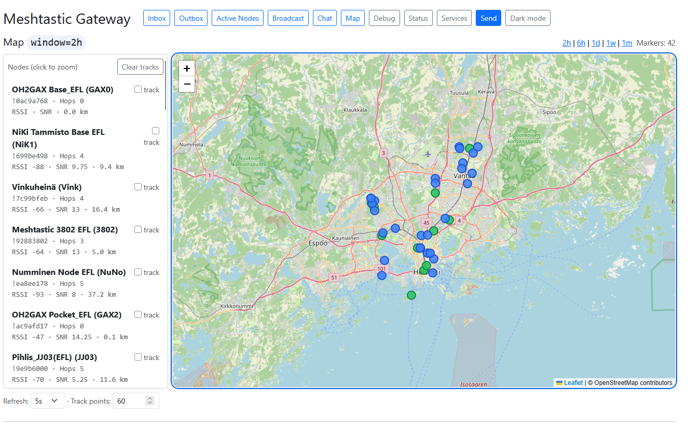

# meshtastic_gateway

Web-based Meshtastic messaging, mapping & debugging application.

<p align="left">
  
</p>


# Meshtastic WiFi Gateway + Web UI (Flask + SQLite)

This project runs on a Raspberry Pi (or any Linux host) and connects to a Meshtastic node over WiFi (TCP) using the Meshtastic Python library. It stores messages and node information in SQLite, and provides a lightweight Flask web UI for viewing and sending messages, monitoring active nodes, viewing positions on a map, and inspecting raw packets.

It also includes a small set of opt-in **Services** that can reply automatically to direct messages — for example, replying with the latest METAR or TAF when a node sends a private message like `wx EFHK` / `taf EFHK`, or with a compact solar-propagation summary on `cmd solar`.


## What it does

### Gateway (WiFi/TCP)

Connects to a Meshtastic device via TCP (WiFi) and subscribes to incoming packets, processing:

- Direct messages
- Broadcast messages on any configured channel (multi-channel)
- Node / user updates (long & short names, hardware model, etc.)
- Positions (for the map and per-node track lines)
- Routing / ACK packets (used to confirm delivery of outgoing direct messages)
- Traffic debug stream
- Message services (METAR, TAF, Solar)

### SQLite database

Stores:

- Inbox / Outbox (direct messages, with unread state)
- Broadcast chat (separate from Inbox/Outbox, per channel)
- Nodes (latest known info, RSSI/SNR, last position)
- Positions (history, used for map markers and tracklines)
- Service log (recent METAR / TAF / Solar queries, status, replies)

The database uses WAL mode, so you will see three files:

```
meshtastic_messages.db
meshtastic_messages.db-wal
meshtastic_messages.db-shm
```

The `-wal` and `-shm` files are normal and required while the database is in WAL mode.

The gateway performs lightweight schema migrations automatically on startup, so upgrading between versions of the script generally does not require touching the database.


## Web UI pages

- **Inbox** — received direct messages, with unread highlighting and per-message *Mark read* / *Delete* buttons (see *New message notifications* below).
- **Outbox** — sent direct messages and send queue status, with an *Ack* column per outgoing message and optional auto-refresh (default 10 s).
- **Active Nodes** — list of heard nodes with selectable time windows, including a *Pos* indicator (`Y` if a position is known, otherwise `—`) and a *Hops* column showing how many hops away each node is (`0` = direct neighbor, `—` = unknown). Optional auto-refresh (`Off` / `10s` / `30s` / `60s`).
- **Broadcast** — chat-style view of broadcast traffic. A channel selector at the top lets you view any of the channels configured on your Meshtastic device, and you can broadcast a message to the currently selected channel from the same page. Optional auto-refresh (`Off` / `10s` / `30s` / `60s`). Broadcast traffic is kept separate from Inbox/Outbox.
- **Map** — last known positions of all heard nodes. Filled circles show node location (green = recent, blue = older); the side list shows hop count and distance per node, and clicking a node opens a popup with full details including hop count. Optional per-node track lines, configurable last *N* points. The map automatically uses light or dark tiles depending on the theme setting.
- **Debug** — terminal-style view of raw JSON packets, with pause/copy/filter controls.
- **Status** — best-effort live node info from the interface plus the gateway's own connection state, and a *Maintenance* card with controls to remove "unknown" nodes (no name received) on demand and to remove a specific node chosen from a dropdown.
- **Services** — enable/disable the combined METAR / TAF / Solar service, configure the reply delay, and see the latest service-traffic log.
- **Send** — per-node chat / send-message view (direct messages), with ACK feedback.

There is also a global **Theme** toggle in the navbar (light / dark) and a **New message** indicator that shows in the top right when there are unread direct messages.

See `Meshtastic_Gateway.pdf` for a UI overview and screenshots.


## Requirements

- Raspberry Pi OS (or Debian / Ubuntu)
- Python 3.9+ recommended (3.11 has been tested)
- A Meshtastic device with WiFi enabled and reachable on your LAN


## Meshtastic device setup (WiFi)

On the Meshtastic device:

- Enable WiFi and connect it to your LAN (DHCP is fine).
- Confirm you can reach it from the Pi (`ping <device-ip>`).
- The Meshtastic Python library connects using the device's TCP "API" interface over WiFi.


## Installation (Raspberry Pi 4)

### 1) System packages

```
sudo apt update
sudo apt install -y python3 python3-venv python3-pip
```

### 2) Clone the repo

```
git clone https://github.com/oh2gax/meshtastic_gateway.git
cd meshtastic_gateway
```

### 3) Create virtual environment + install dependencies

```
python3 -m venv venv
source venv/bin/activate
pip install --upgrade pip
pip install meshtastic flask pypubsub
```

If you prefer, create a `requirements.txt`:

```
meshtastic
flask
pypubsub
```

and install with:

```
pip install -r requirements.txt
```

### 4) Configure the gateway

Edit the main script (e.g. `gateway_web_stable.py`) and update the configuration section near the top.

Meshtastic device IP address:

```
HOST = "192.168.1.100"
```

SQLite database file path:

```
DB_PATH = "/home/pi/meshtastic_gateway/meshtastic_messages.db"
```

Web UI bind address + port:

```
WEB_HOST = "0.0.0.0"
WEB_PORT = 8000
```

Notes:

- `HOST` must be the IP of your Meshtastic device on WiFi (DHCP or static).
- `WEB_HOST = "0.0.0.0"` makes it accessible from other machines on your LAN. Use `"127.0.0.1"` for local-only access.

### 5) Run it

```
source venv/bin/activate
python3 gateway_web_stable.py
```

To run in the background:

```
nohup python3 gateway_web_stable.py > /dev/null 2>&1 &
ps -ef
```

To kill the background process:

```
ps -ef
kill <process number>
```

Open in a browser:

```
http://<raspberry-pi-ip>:8000
```


## Common operations

### Inbox — received direct messages

All received direct messages with date/time, RSSI/SNR, and per-message actions:

- **Unread highlighting:** newly arrived direct messages are highlighted (light yellow in light mode, dark amber in dark mode), with a small red dot before the timestamp.
- **Mark read:** each unread row has a *Mark read* button that clears the highlight and removes that message from the unread count.
- **Mark all read:** a button at the top of the page marks every unread direct message as read in one click.
- **Delete:** removes the message from the database.

Broadcast messages and incoming service commands (see *Services*) are not stored in the Inbox.

### Outbox — sent direct messages and queue status

All sent direct messages, their destination, send status, and an **Ack** column showing the delivery state of each outgoing message. The display follows Android-style conventions:

- `Y` (green) — **end-to-end ACK from the recipient**. The routing reply we received was generated by the destination node itself, so we know the message was actually delivered.
- `S` (yellow/orange) — **sent, no end-to-end ACK**. Either no routing reply came back (firmware reported `MAX_RETRANSMIT` / `TIMEOUT` / a routing error), or a "no error" reply came back but it was generated by some *other* node — typically a relay that overheard the packet and forwarded it (Meshtastic firmware synthesizes a local "implicit ACK" in that situation). The destination may or may not have received the message.
- `…` (gray) — waiting for the routing reply. Normal short-lived state right after sending.
- `—` (faded) — not applicable. Used for broadcasts (which don't get end-to-end ACKs) and for entries where the radio hand-off failed before the packet ever went on-air.

To tell `Y` and `S` apart correctly, the gateway compares the `fromId` of each incoming routing reply against the original destination of the matching outbox entry. A match means the recipient genuinely answered; a mismatch means an intermediate relay generated the implicit reply. This avoids the common Meshtastic pitfall where a DM to a powered-off node would otherwise appear to "ACK" simply because one of your own relays forwarded the packet.

The raw retransmission count is no longer shown in the table — it didn't add useful information for normal use. The `last_error` text still appears as a small red row underneath any failed entry, so a true send failure is still obvious. The Pi terminal log line for each ACK event also includes the routing-reply sender's node id (`ack_from=…`), which is handy for diagnosing implicit-ACK behavior.

A *Refresh* dropdown (`Off` / `10s` / `30s` / `60s`) sits next to the page-size links. It defaults to **10 s** because the typical reason to look at the Outbox is to watch a freshly sent DM transition from `…` to `Y` or `S`. The choice is remembered in the browser via `localStorage`.

Each entry has a *Delete* button to remove it from the queue / log.

### Active Nodes

All heard nodes with timestamp, RSSI/SNR and other per-node info, filtered by a selectable time window. Two compact columns at the right of the table summarize the radio path:

- **Pos** — `Y` if the node has shared a position (which you'll then see on the *Map* page), `—` otherwise. Lat/lon values themselves are intentionally not shown here; the Map page is the right place to look at coordinates.
- **Hops** — how many hops the most recent packet from this node travelled to reach the gateway. `0` means a direct neighbor (heard on-air with no relay); `1`, `2`, … indicate the number of relays involved. `—` means the hop information was not available in the packets seen so far (e.g. older firmware or packet types that don't carry it).

The Hops value reflects the most recent packet from each node. If a relay path changes, the value updates the next time we hear from that node.

A *Refresh* dropdown next to the time-window links lets you set the page to auto-refresh at a fixed interval (`10s`, `30s`, `60s`) or leave it `Off` (default). The choice is remembered in the browser via `localStorage`, so it sticks across visits without affecting other pages.

### Broadcast messages

Chat-style view of broadcast traffic. Use the channel selector at the top of the page to switch between any channels configured on your Meshtastic device. You can broadcast a message to the currently selected channel from the same page. Broadcast traffic is kept separate from Inbox/Outbox.

A *Refresh* dropdown next to the channel and page-size selectors lets the page auto-refresh at a fixed interval (`10s`, `30s`, `60s`) or stay at `Off` (default). The choice is persisted in the browser via `localStorage` (under its own key, separate from the Active Nodes and Outbox refresh settings).

### Map

- Shows last known positions for nodes that have published positions.
- Each node is rendered as a filled circle:
  - **Green** — node was heard recently (within ~15 minutes).
  - **Blue** — node was heard earlier than that.
- Clicking a circle (or a node entry in the side list) opens a popup with the node's name, hardware, last-seen time, position time, RSSI/SNR, lat/lon, and **hop count** (`0` = direct neighbor, `—` if unknown).
- The side list shows each node's device id with hop count appended (e.g. `!0ac9a768 · Hops 2`), plus its RSSI/SNR and the **distance from the gateway** (great-circle, in km). The hop suffix is omitted when no hop data is available yet, so the line stays uncluttered for nodes we haven't fully observed.
- Track lines can be enabled per node. Track length is configurable via the *Track points* setting on the page (default 60).
- The map switches between standard OSM tiles and a dark CARTO basemap automatically when you toggle the global Theme button.

### Debug terminal

- Shows raw incoming JSON packet data.
- Supports pause/resume, copy-to-clipboard, and basic filtering.

### Status

Basic status of the gateway and the Meshtastic device it's connected to (connection state, local node summary, best-effort live node info), plus a *Maintenance* card.

#### Maintenance — Remove unknown nodes

Meshtastic radios can pick up the *node number* of a remote node from any packet, but the human-readable name and hardware information only arrive with that node's *NodeInfo* broadcast. If the gateway hears traffic from a distant node but never receives its NodeInfo, the entry sits in the Active Nodes list with no name (the Android app shows it as "unknown"). These can accumulate over time and are usually not actionable.

The Status page has two cleanup mechanisms:

- **Automatic.** A background task in the gateway scans the database periodically (every 30 minutes) and removes any unknown node — defined as having no `long_name` and no `short_name` — that hasn't been heard for at least **24 hours**. Removal sends an admin command to the connected device telling it to drop the node from its NodeDB, and also clears the row from the gateway's SQLite. The library's in-memory node cache is evicted at the same time so the entry doesn't reappear on the next refresh cycle.
- **Manual button.** *Remove unknown nodes now* on the Status page runs the same cleanup immediately and without the 24-hour age filter, for when you want a clean slate before the timer fires. The result of the last manual run (scanned / removed / skipped / failed counts) is shown above the button. The gateway's own node is always skipped.

A removed unknown node can come back if it transmits again and the device re-learns it from a packet — that is normal and matches the Android app's behavior. There is no "ignore forever" in the standard Meshtastic admin API.

#### Maintenance — Remove specific node

Below the unknown-node controls, the Maintenance card has a *Remove specific node* section for one-off cleanups of a particular node — useful for stale entries that aren't matched by the unknown rule (for example, a node that has full NodeInfo but no longer exists in the device's NodeDB and keeps getting re-added by the gateway from on-air packets).

The dropdown lists every node currently in the gateway's database, sorted with the most recently heard first. Picking one and clicking *Remove selected node* sends the admin `removeNode` command to the connected device, evicts the entry from the library's in-memory cache, and deletes the row from the gateway's SQLite — even if the device-side removal reports nothing was there to remove. The gateway's own node is never offered in the dropdown. A small banner above the dropdown shows the result of the last removal (success / message). All actions are logged to the Debug stream.

This action is also subject to the same caveat as the unknown cleanup: a node that's still actively transmitting on the air can be re-learned from a future packet and reappear. For the typical "stuck" entries, though, removal sticks.

### Services

The Services page hosts a combined **METAR / TAF / Solar** weather and propagation service. A single Enabled/Disabled switch controls all three, and they share one reply-delay setting. Currently implemented commands (sent to the gateway as private direct messages):

- **`wx <ICAO>`** — replies with the latest METAR for that airport. Any four-letter ICAO code worldwide works (e.g. `wx efhk` for Helsinki-Vantaa, `wx kjfk` for JFK). Source: NOAA TGFTP.
- **`taf <ICAO>`** — replies with the latest TAF (Terminal Aerodrome Forecast). The leading `TAF EFHK` keyword is stripped to save bytes (you already know the ICAO from your query) but the issuance timestamp (`ddhhmmZ`) is kept so you can see when the forecast was generated. Same source. TAF replies are truncated to fit one Meshtastic packet (~220 chars); trailing characters that don't fit are dropped and an `…` is appended.
- **`cmd solar`** — replies with a compact one-line solar / propagation summary built from `hamqsl.com/solarxml.php`. The reply uses short labels in this order, omitting any field the source didn't report: `SFI` (10.7 cm flux), `SN` (sunspot number), `X` (X-ray class), `A` (A index), `K` (K index), `AU` (aurora), `BZE` (interplanetary magnetic field Bz), `SW` (solar wind, km/s), `Pf` (proton flux), `Ef` (electron flux). Example: `SFI 143 SN 160 X B9.7 A 4 K 1 AU 4 BZE -4.0 SW 377.2 Pf 14 Ef 2360`. The same 220-char truncation applies.

Other Services controls:

- **Reply delay.** A configurable delay (seconds) before any service reply is sent, useful for nodes that are slow to switch RX/TX state. Shared by all three commands.
- **Service log.** The Services page shows the most recent requests across all three services with status (`req` / `ok` / `queued` / `fail`) and a service column so you can tell METAR / TAF / Solar entries apart at a glance.

Service-command messages (e.g. `wx EFHK`, `taf EFHK`, `cmd solar`) are **not** stored in the Inbox or counted toward the unread count — they are treated as commands rather than chat. The pattern list is centralized in the code (`SERVICE_COMMAND_PATTERNS`), so adding more `cmd <name>` style commands later is a one-line change.

### Send a direct message

Use the web UI's *Send* page (or per-node *Chat* page from the active node list) to send direct messages. The Outbox shows ACK status as the message progresses.

### Theme (dark / light)

Use the **Theme** button in the navbar to switch between light and dark UI modes. The choice is remembered across sessions and is also applied to the map tiles.

### New message notifications

Whenever there are unread direct messages, a **New message** indicator appears in the top-right of the navbar. The indicator is a link to the Inbox; clicking it takes you straight there. The page polls the unread count every few seconds, so the indicator updates without needing a manual refresh. Broadcasts and service-command messages do not trigger the indicator.

To clear the indicator, mark the relevant messages as read on the Inbox page (per message or all at once).


## Running as a service (optional)

Create a systemd unit to start the gateway on boot.

Example: `/etc/systemd/system/meshtastic-gateway.service`

```
[Unit]
Description=Meshtastic WiFi Gateway Web UI
After=network-online.target
Wants=network-online.target

[Service]
Type=simple
User=pi
WorkingDirectory=/home/pi/<your-repo>
ExecStart=/home/pi/<your-repo>/venv/bin/python3 /home/pi/<your-repo>/gateway_web_stable.py
Restart=always
RestartSec=3

[Install]
WantedBy=multi-user.target
```

Enable + start:

```
sudo systemctl daemon-reload
sudo systemctl enable meshtastic-gateway
sudo systemctl start meshtastic-gateway
sudo systemctl status meshtastic-gateway
```


## Database files

```
meshtastic_messages.db
meshtastic_messages.db-wal
meshtastic_messages.db-shm
```

That's expected. SQLite WAL mode uses these for performance and safe concurrency while the app is running. Do not delete them while the gateway is running.


## Security notes

The web UI has no authentication by default. If exposed beyond your LAN, put it behind a reverse proxy with authentication, or bind it to `127.0.0.1` and access it through an SSH tunnel.
